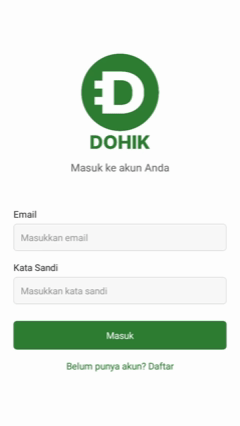

# DOHIKAPP - Aplikasi Manajemen Keuangan Personal

DOHIKAPP adalah aplikasi mobile dan web untuk mengelola keuangan pribadi dengan mudah. Aplikasi ini membantu pengguna melacak pendapatan, pengeluaran, mengkategorikan transaksi, dan membuat laporan keuangan.

## 🎥 Demo Aplikasi


## 📋 Daftar Isi

- [Fitur Utama](#fitur-utama)
- [Persyaratan Sistem](#persyaratan-sistem)
- [Instalasi](#instalasi)
- [Cara Penggunaan](#cara-penggunaan)
- [Struktur Proyek](#struktur-proyek)
- [Database](#database)
- [API dan Context](#api-dan-context)
- [Troubleshooting](#troubleshooting)
- [Kontribusi](#kontribusi)

## 🎯 Fitur Utama

### 1. **Autentikasi Pengguna**
- Registrasi akun baru
- Login dengan email dan password
- Logout
- Manajemen profil pengguna

### 2. **Manajemen Transaksi**
- Mencatat pendapatan dan pengeluaran
- Mengkategorikan transaksi (Gaji, Makan, Transportasi, dll)
- Menambah kategori custom
- Menampilkan daftar transaksi dengan filter

### 3. **Laporan Keuangan**
- Ringkasan pendapatan dan pengeluaran
- Visualisasi data dengan chart
- Laporan berdasarkan periode (harian, mingguan, bulanan)
- Export laporan ke PDF

### 4. **Pengingat Tagihan**
- Membuat pengingat untuk tagihan berulang
- Notifikasi otomatis untuk tagihan yang akan jatuh tempo
- Menandai tagihan sebagai lunas

### 5. **Profil Pengguna**
- Menampilkan informasi profil
- Ubah foto profil
- Ubah password
- Lihat riwayat transaksi

## 🔧 Persyaratan Sistem

### Untuk Development:
- Node.js >= 18.0.0
- npm atau yarn
- Expo CLI (`npm install -g expo-cli`)
- Android Studio (untuk testing Android)
- Xcode (untuk testing iOS, hanya macOS)

### Untuk Production:
- Android 8.0+ (API Level 24+)
- iOS 13.0+
- Browser modern (Chrome, Safari, Edge)

## 📥 Instalasi

### 1. Clone Repository
```bash
git clone <repository-url>
cd DOHIKAPP
```

### 2. Install Dependencies
```bash
npm install
```

### 3. Konfigurasi Environment (Opsional)
```bash
# Copy file env template jika ada
cp .env.example .env
```

### 4. Jalankan Development Server

#### Untuk Web:
```bash
npm run dev
# atau
npx expo start --web
```

#### Untuk Android:
```bash
npm run android
# atau
npx expo run:android
```

#### Untuk iOS:
```bash
npm run ios
# atau
npx expo run:ios
```

## 💡 Cara Penggunaan

### Login/Registrasi
1. Buka aplikasi
2. Klik tombol "Daftar" untuk membuat akun baru
3. Isi Nama Lengkap, Email, dan Password
4. Klik tombol "Daftar"
5. Atau jika sudah punya akun, klik "Masuk" dan login

### Mencatat Transaksi
1. Dari halaman utama, klik tombol "+" atau tab "Tambah"
2. Pilih tipe transaksi (Pendapatan/Pengeluaran)
3. Pilih kategori
4. Masukkan jumlah dan catatan
5. Klik tombol "Simpan"

### Melihat Laporan
1. Klik tab "Ringkasan"
2. Lihat overview pendapatan vs pengeluaran
3. Pilih periode untuk melihat detail

### Mengatur Pengingat
1. Klik tab "Pengingat"
2. Klik "Tambah Pengingat"
3. Isi nama tagihan dan tanggal jatuh tempo
4. Klik "Simpan"

### Mengelola Profil
1. Klik tab "Profil"
2. Lihat informasi akun
3. Klik tombol ubah untuk mengupdate profil atau password

## 📁 Struktur Proyek

```
DOHIKAPP/
├── app/                      # Halaman dan routing utama
│   ├── (tabs)/              # Tab navigation screens
│   │   ├── _layout.tsx      # Tab layout config
│   │   ├── index.tsx        # Halaman home/dashboard
│   │   ├── add.tsx          # Halaman tambah transaksi
│   │   ├── summary.tsx      # Halaman laporan/ringkasan
│   │   └── profile.tsx      # Halaman profil pengguna
│   ├── auth.tsx             # Halaman login/registrasi
│   ├── index.tsx            # Root/splash screen
│   └── _layout.tsx          # Root layout dengan context providers
├── context/                  # State management & context
│   ├── AuthContext.tsx      # Authentication context
│   ├── DatabaseContext.tsx  # Database initialization & management
│   └── NotificationContext.tsx # Push notifications setup
├── hooks/                    # Custom React hooks
│   └── useFrameworkReady.ts # Hook untuk mengecek framework ready
├── assets/                   # Static assets
│   └── images/              # Image files
├── android/                  # Android native configuration
├── package.json             # Dependencies dan scripts
├── tsconfig.json            # TypeScript configuration
├── metro.config.js          # Metro bundler configuration
└── app.json                 # Expo configuration
```

## 🗄️ Database

### Teknologi Database
- **SQLite** via `expo-sqlite`
- Database lokal di perangkat pengguna
- Nama database: `sakuperantau.db`

### Schema Database

#### Tabel: `users`
```sql
CREATE TABLE users (
  id INTEGER PRIMARY KEY AUTOINCREMENT,
  nama_lengkap TEXT NOT NULL,
  email TEXT UNIQUE NOT NULL,
  password_hash TEXT NOT NULL,
  foto_profil TEXT,
  created_at DATETIME DEFAULT CURRENT_TIMESTAMP
);
```

#### Tabel: `categories`
```sql
CREATE TABLE categories (
  id INTEGER PRIMARY KEY AUTOINCREMENT,
  nama TEXT NOT NULL,
  type TEXT NOT NULL CHECK (type IN ('income', 'expense')),
  is_default INTEGER DEFAULT 0,
  created_at DATETIME DEFAULT CURRENT_TIMESTAMP
);
```

#### Tabel: `records`
```sql
CREATE TABLE records (
  id INTEGER PRIMARY KEY AUTOINCREMENT,
  user_id INTEGER NOT NULL,
  category_id INTEGER NOT NULL,
  amount REAL NOT NULL,
  type TEXT NOT NULL CHECK (type IN ('income', 'expense')),
  catatan TEXT,
  tanggal DATE NOT NULL,
  created_at DATETIME DEFAULT CURRENT_TIMESTAMP,
  FOREIGN KEY (user_id) REFERENCES users (id),
  FOREIGN KEY (category_id) REFERENCES categories (id)
);
```

#### Tabel: `reminders`
```sql
CREATE TABLE reminders (
  id INTEGER PRIMARY KEY AUTOINCREMENT,
  user_id INTEGER NOT NULL,
  nama_tagihan TEXT NOT NULL,
  tanggal_jatuh_tempo DATE NOT NULL,
  is_active INTEGER DEFAULT 1,
  created_at DATETIME DEFAULT CURRENT_TIMESTAMP,
  FOREIGN KEY (user_id) REFERENCES users (id)
);
```

### Kategori Default
Aplikasi menyediakan kategori default:
- **Pendapatan**: Gaji, Uang Saku
- **Pengeluaran**: Kos, Makan, Transportasi, Internet, Hiburan, Kesehatan

## 🔌 API dan Context

### AuthContext
Mengelola autentikasi pengguna dan state user.

**Methods:**
- `login(email, password)` - Login user
- `register(namaLengkap, email, password)` - Registrasi user baru
- `logout()` - Logout user
- `updateUser(userData)` - Update profil user
- `updatePassword(oldPassword, newPassword)` - Ubah password

**Usage:**
```typescript
import { useAuth } from '@/context/AuthContext';

export default function MyComponent() {
  const { user, login, register, logout } = useAuth();
  // ...
}
```

### DatabaseContext
Mengelola koneksi dan inisialisasi database SQLite.

**Properties:**
- `db` - Instance database SQLite
- `isReady` - Boolean status database ready

**Usage:**
```typescript
import { useDatabase } from '@/context/DatabaseContext';

export default function MyComponent() {
  const { db, isReady } = useDatabase();
  
  if (!isReady) return <Loading />;
  
  // Database siap digunakan
}
```

### NotificationContext
Mengelola push notifications dan local notifications.

**Methods:**
- `requestPermissions()` - Minta izin notifikasi
- `scheduleReminder(data)` - Schedule notifikasi
- `cancelNotification(id)` - Batalkan notifikasi

## 🎨 Styling

Aplikasi menggunakan:
- **React Native StyleSheet** untuk styling cross-platform
- **Responsive design** yang menyesuaikan dengan ukuran layar
- **Custom color scheme** dengan tema hijau (#2E7D32)

## 🔐 Security

### Password Security
- Password di-hash menggunakan SHA256 (`expo-crypto`)
- Password tidak pernah disimpan dalam plain text
- Session disimpan di AsyncStorage dengan token ID user

### Data Protection
- Database SQLite lokal di device
- Tidak ada data yang dikirim ke server eksternal
- AsyncStorage untuk session management

## 🚀 Deployment

### Build APK Android
```bash
cd android
./gradlew app:assembleDebug
# Output: android/app/build/outputs/apk/debug/app-debug.apk
```

### Build Release Android
```bash
cd android
./gradlew app:assembleRelease
# Butuh signing keystore configuration
```

### Build Web Production
```bash
npm run build:web
```

## 🐛 Troubleshooting

### Database tidak terbuat
**Gejala:** Registrasi gagal, error "database not initialized"

**Solusi:**
1. Bersihkan cache: `npm start -- --clear`
2. Restart aplikasi
3. Periksa console log untuk error detail
4. Pastikan `DatabaseProvider` membungkus aplikasi di `_layout.tsx`

### Notifikasi tidak muncul
**Gejala:** Pengingat tidak menampilkan notifikasi

**Solusi:**
1. Pastikan permission notifikasi sudah diberikan
2. Buka DevTools dan cek console untuk error
3. Cek scheduled reminders di database
4. Pastikan app tidak dalam background mode terlalu lama

### Login/Registrasi tidak bekerja
**Gejala:** Form tidak responsif atau selalu menampilkan error

**Solusi:**
1. Periksa console browser/app untuk error
2. Pastikan database sudah ready (lihat `isReady` dari DatabaseContext)
3. Validasi format email (xxx@xxx.xxx)
4. Password minimal 6 karakter

### Build Android gagal
**Gejala:** Gradle error saat `./gradlew app:assembleDebug`

**Solusi:**
1. Pastikan Android SDK level 33 terinstall
2. Set `ANDROID_HOME` environment variable
3. Gunakan JDK 17 (bukan 22):
   ```bash
   export JAVA_HOME=/path/to/jdk17
   ```
4. Bersihkan build cache:
   ```bash
   cd android && ./gradlew clean
   ```

## 📱 Platform Support

| Platform | Status | Catatan |
|----------|--------|---------|
| Android | ✅ Supported | Min API 24 (Android 8.0) |
| iOS | ✅ Supported | Min iOS 13.0 |
| Web | ✅ Supported | Chrome, Safari, Edge |

## 📦 Dependencies Utama

- **expo**: Framework React Native universal
- **expo-router**: Navigation & routing
- **expo-sqlite**: Database SQLite lokal
- **expo-crypto**: Password hashing
- **expo-notifications**: Push notifications
- **react-native**: Core React Native
- **@react-navigation**: Navigation library
- **@react-native-async-storage**: Local storage

## 🔄 Development Workflow

### 1. Membuat Fitur Baru
```bash
# 1. Create branch
git checkout -b feature/nama-fitur

# 2. Buat file komponen/context baru
# 3. Import di file yang diperlukan
# 4. Test di device/emulator
# 5. Commit
git add .
git commit -m "feat: deskripsi fitur"
git push origin feature/nama-fitur
```

### 2. Git Conventions
- **feat**: Feature baru
- **fix**: Bug fix
- **docs**: Documentation update
- **style**: Code style changes
- **refactor**: Code refactoring
- **test**: Adding tests
- **chore**: Build/dependency updates

### 3. Testing
```bash
# Lint code
npm run lint

# TypeScript check
npx tsc --noEmit

# Run on device
npm run dev          # Web
npm run android      # Android
npm run ios          # iOS
```

## 📝 Dokumentasi Kode

Kode menggunakan TypeScript dengan type safety yang kuat. Setiap component dan function memiliki JSDoc comments.

### Type Definitions

```typescript
// Auth user type
interface User {
  id: number;
  nama_lengkap: string;
  email: string;
  foto_profil?: string;
}

// Transaction record
interface Record {
  id: number;
  user_id: number;
  category_id: number;
  amount: number;
  type: 'income' | 'expense';
  catatan?: string;
  tanggal: string;
  created_at: string;
}

// Reminder
interface Reminder {
  id: number;
  user_id: number;
  nama_tagihan: string;
  tanggal_jatuh_tempo: string;
  is_active: number;
  created_at: string;
}
```

## 🤝 Kontribusi

Untuk berkontribusi pada proyek ini:

1. Fork repository
2. Buat branch fitur: `git checkout -b feature/AmazingFeature`
3. Commit perubahan: `git commit -m 'Add some AmazingFeature'`
4. Push ke branch: `git push origin feature/AmazingFeature`
5. Buka Pull Request

## 📄 Lisensi

Proyek ini menggunakan lisensi privat. Hubungi owner untuk informasi lebih lanjut.

## 👨‍💻 Author

**Febrian Suban**
- Repository: [DOHIKAPP](https://github.com/FebrianSuban/DOHIKAPP)

## 📞 Support & Contact

Untuk pertanyaan, bug report, atau saran:
1. Buka issue di GitHub
2. Hubungi developer melalui email
3. Cek dokumentasi FAQ (jika ada)

## 🗓️ Changelog

### v1.0.0 (2025-11-11)
- ✨ Initial release
- 🎯 Fitur autentikasi user
- 💰 Manajemen transaksi income/expense
- 📊 Laporan keuangan dengan visualisasi
- 🔔 Pengingat tagihan dengan notifikasi
- 👤 Manajemen profil user
- 📱 Support mobile (Android/iOS) dan web

---

**Last Updated:** November 11, 2025  
**Maintained by:** Febrian Suban
=======

>>>>>>> 7803c2fe8c2ca0a9f555d4aa87fe4c155fbeee38
